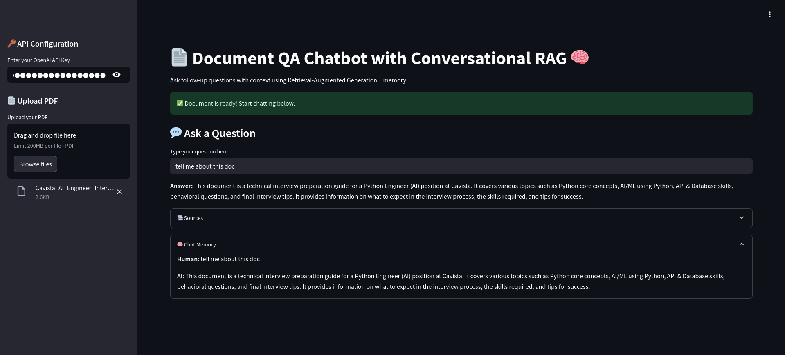

# 🧠 Document QA Chatbot (RAG + LangChain + OpenAI)

Ask questions from any PDF using GPT and LangChain-powered retrieval augmented generation (RAG).

##  Features
- ✅ Upload and chunk PDFs
- ✅ Embed and index with FAISS
- ✅ Answer questions with GPT (ChatOpenAI)
- ✅ Conversational memory
- ✅ Web app using Streamlit

##  Tech Stack
- LangChain
- OpenAI GPT (3.5/4)
- FAISS
- Streamlit
- Python 3.10+
- RAG architecture

##  Setup

```bash
git clone https://github.com/your-username/Document-QA-BOT.git
cd Document-QA-BOT
python -m venv .venv
source .venv/bin/activate  # or .venv\Scripts\activate on Windows
pip install -r requirements.txt
```


## Example

    Upload your PDF → Ask: "What is the contract term?"

## Disclaimer

This project is for educational/demo purposes. Do not upload sensitive data.

## Screenshot




---

## ✅ Step 5: Initialize Git & Push to GitHub

```bash
git init
git add .
git commit -m "Initial commit: Document QA Bot with LangChain and Streamlit"
git branch -M main
git remote add origin https://github.com/your-username/Document-QA-BOT.git
git push -u origin main
```


    👤 Built by oluwafemi oloye — AI Engineer | AI automation engineer | ml engineer
    💼 Portfolio: https://femi-oloye.github.io/Portfolio/
    📬 Reach me on https://www.linkedin.com/in/oluwafemi-oloye-a3b772353/
